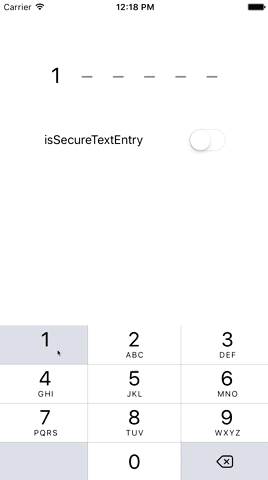

# UXPasscodeField

[](https://travis-ci.org/Eddie Lau/UXPasscodeField)
[](http://cocoapods.org/pods/UXPasscodeField)
[](http://cocoapods.org/pods/UXPasscodeField)
[](http://cocoapods.org/pods/UXPasscodeField)

## Screenshot



## Example Project

To run the example project, clone the repo, and run `pod install` from the Example directory first.


## Sample Code

### UXPasscodeField
```swift
import UIKit
import UXPasscodeField

class ViewController: UIViewController {

    @IBOutlet weak var passcodeField: UXPasscodeField!

    override func viewDidLoad() {
        super.viewDidLoad()

        passcodeField.becomeFirstResponder()

        // Optional, default is 6
        passcodeField.numberOfDigits = 6

        // Optional, default is false
        passcodeField.isSecureTextEntry = false

        passcodeField.addTarget(
          self,
          action: #selector(ViewController.passcodeFieldDidChangeValue),
          for: .valueChanged)

    }

    @IBAction func passcodeFieldDidChangeValue() {
        print(passcodeField.passcode)
    }

}
```
### UXPasscodeViewController
```swift
  let passcodeViewController = UXPasscodeViewController.instantiate()
  passcodeViewController.message = "Hello iOS developer! Please input your 4-digit code here."
  passcodeViewController.numberOfDigits = 4
  passcodeViewController.done { passcode in

      print(passcode)
      _ = passcodeViewController.resignFirstResponder()

  }
```

## Requirements

iOS 8 or above.

## Installation

UXPasscodeField is available through [CocoaPods](http://cocoapods.org). To install
it, simply add the following line to your Podfile:

```ruby
pod "UXPasscodeField"
```

## Author

Eddie Lau, eddie@touchutility.com

## License

UXPasscodeField is available under the MIT license. See the LICENSE file for more info.
